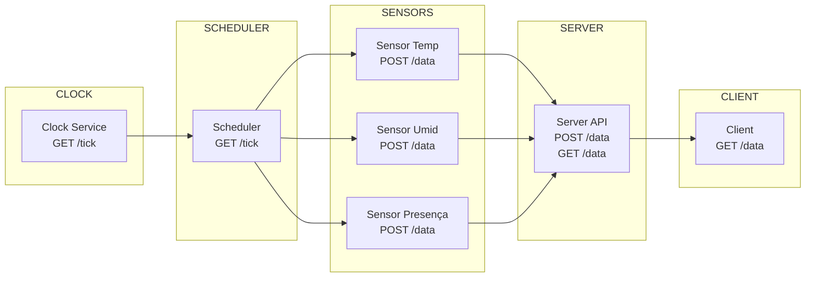
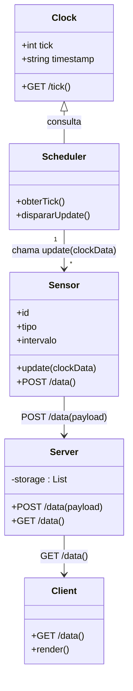
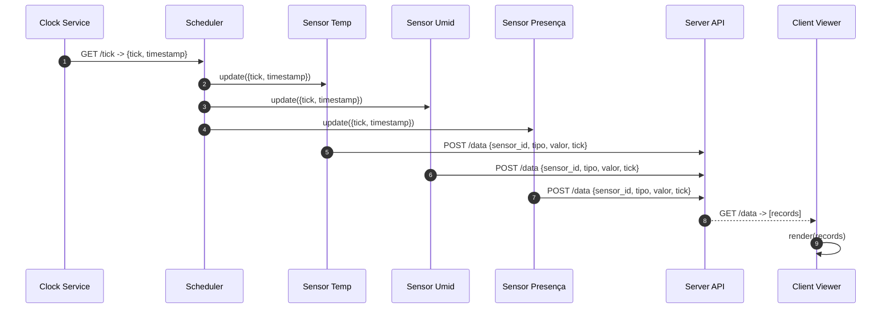

# SmartBuilding – Arquitetura Distribuída com Microsserviços em Docker

Este projeto implementa uma **simulação completa de um Smart Building** utilizando uma arquitetura distribuída baseada em **microsserviços**, comunicação via **HTTP**, containers **Docker** e sincronização global através de um **Clock acelerado**.

A solução foi desenvolvida para fins acadêmicos, demonstrando conceitos de:
- Sistemas distribuídos
- Sincronização de processos
- Comunicação entre microsserviços
- Arquitetura orientada a eventos
- Simulação de dispositivos IoT
- Orquestração com Docker Compose

---

## 📡 Visão Geral da Arquitetura

A simulação é composta por **7 microsserviços**, cada um executando em seu próprio container Docker:

| Serviço | Função |
|--------|--------|
| **clock** | Gera o tempo global do sistema (tick + timestamp ISO) |
| **scheduler** | Controla o ciclo de atualização dos sensores consultando o clock |
| **sensor_temp_01** | Sensor virtual de temperatura |
| **sensor_umid_01** | Sensor virtual de umidade |
| **sensor_presenca_01** | Sensor virtual de presença |
| **server** | Recebe e armazena dados enviados pelos sensores |
| **client** | Consulta o servidor e exibe os dados coletados |

Todos os serviços se comunicam via HTTP dentro da mesma rede Docker.

---

## 🧩 Fluxo de Comunicação

1. **Clock** gera ticks acelerados e expõe `GET /tick`.
2. **Scheduler** consulta o clock e envia o tick atual para os sensores.
3. **Sensores** recebem o tick, geram uma leitura e enviam `POST /data` para o servidor.
4. **Server** armazena e imprime os dados recebidos.
5. **Client** consome `GET /data` periodicamente para exibir o estado do sistema.

---

## 📁 Estrutura de Pastas
```
Rede/
├── clock/
│     ├── Dockerfile
│     ├── requirements.txt
│     └── clock.py
├── server/
│     ├── Dockerfile
│     ├── requirements.txt
│     └── server.py
├── client/
│     ├── Dockerfile
│     ├── requirements.txt
│     └── client.py
├── scheduler/
│     ├── Dockerfile
│     ├── requirements.txt
│     └── scheduler.py
├── sensor/
│     ├── Dockerfile
│     ├── requirements.txt
│     └── sensor.py
└── docker-compose.yml
```

---

## 🚀 Como Executar o Sistema

### 1. Certifique-se de ter o Docker e Docker Compose instalados.

### 2. No diretório raiz (`Rede/`), execute:

```bash
docker compose up --build
```

### 🌐 Endpoints HTTP Expostos
Clock

GET /tick

Retorna:

```json
{
  "tick": 1234,
  "timestamp": "2026-05-23T20:11:00.123456+00:00"
}
```

Server
```
POST /data
```
Payload enviado pelos sensores:
```json
{
  "sensor_id": "sensor-temperature-4821",
  "tipo": "temperature",
  "valor": 22.5,
  "tick": 1234
}
```
```
GET /data
```
Retorna lista de todos os registros recebidos.

Client

Não expõe endpoints — apenas consome GET /data e imprime no terminal.

## 🏗️ Tecnologias Utilizadas
- Python 3.11

- Flask

- Requests

- Docker

- Docker Compose

- Microsserviços independentes

- Comunicação HTTP

- Sincronização via Clock distribuído

## 📘 Objetivo Acadêmico
Este projeto demonstra:

- Sincronização distribuída baseada em tempo lógico

- Comunicação entre serviços isolados

- Simulação de dispositivos IoT

- Arquitetura escalável e modular

- Orquestração de múltiplos containers

## Diagramas

### Diagrama Técnico


### Diagrama UML dos Componentes

### Diagrama UML de Sequência


## 🏁 Conclusão
A arquitetura final implementa um Smart Building virtual completo, com:

Sincronização global via clock

- Sensores independentes

- Scheduler centralizado

- Backend de coleta

- Cliente de visualização

- Microsserviços isolados e escaláveis

Pronto para ser apresentado, avaliado e expandido para integrações reais (MQTT, Supabase, FastAPI, dashboards etc.).